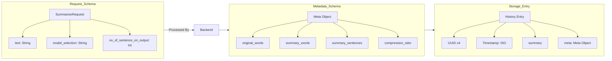

# Text Summarizer DL & CC - Technical Documentation

This project is a high-performance, full-stack text summarization application that leverages both classical frequency-based algorithms and modern deep learning models.

---

## 1. Project Workflow

The following flowchart illustrates the non-linear process from a user's initial text input to the final summarized output and history archival.

```mermaid
graph TD
    Start([User Input]) --> UI[React Frontend: InputCard]
    UI --> Validate{Text Valid?}
    
    Validate -- No --> Notify[Show Warning: "Empty Text"]
    Validate -- Yes --> API_Call[Axios POST /summarize]
    
    subgraph Backend: FastAPI
        API_Call --> PreProcess[text_cleaner.py: Preprocessing]
        PreProcess --> Model_Switch{Select Strategy}
        
        Model_Switch -- "Custom Algorithm" --> TFIDF[python_algo.py: TF-IDF + Position Bias]
        Model_Switch -- "Library Models" --> Sumy[sumy_lib_based.py: LexRank/LSA/TextRank]
        Model_Switch -- "Deep Learning" --> BART[transformers_based.py: BART LLM]
        
        TFIDF --> Aggregator[Metadata Calculator]
        Sumy --> Aggregator
        BART --> Aggregator
        
        Aggregator --> Record[Save to history/history.json]
        Record --> Return[JSON Response]
    end
    
    Return --> UI_Update[Render Summary & Statistics]
    UI_Update --> End([Result Displayed])
```

---

## 2. In-Depth: How It Works

### Frontend Architecture
Built with **React (Vite)** and **Vanilla CSS**, the UI is designed for a premium, responsive experience.
- **Sidebar**: Controls model selection and summary length (sentence count).
- **History Panel**: Fetches and manages past summarizations stored on the server.
- **State Management**: Uses React hooks (`useState`, `useEffect`) to manage real-time text input and asynchronous API responses from the FastAPI backend.

### Backend Architecture
Built with **FastAPI**, the backend handles both lightweight mathematical computations and heavy deep learning inference.
- **REST Endpoints**: Efficiently serves summarization, text cleaning, and history management.
- **Preprocessing**: Every input goes through `text_cleaner.py` to remove redundant whitespaces and normalize formatting while preserving intent.

---

## 3. Deep Learning Implementation (BART)

The project utilizes the **BART (Bidirectional and Auto-Regressive Transformers)** model for abstractive summarization.

### Technical Detail: BART Model
- **Model Used**: `facebook/bart-large-cnn`
- **Architecture**: A Sequence-to-Sequence (Seq2Seq) model with a bidirectional encoder (like BERT) and an autoregressive decoder (like GPT).
- **Mechanism**:
    1. **Tokenization**: The input text is converted into subword tokens using a Byte-Pair Encoding (BPE).
    2. **Contextual Encoding**: The encoder processes the full context of the input text simultaneously.
    3. **Abstractive Generation**: Unlike extractive models that just pick sentences, the decoder generates *new* sentences that capture the essence of the input.
    4. **Beam Search**: The model uses a beam search algorithm (num_beams=4) to explore multiple possible word sequences and select the most coherent summary.

---

## 4. Custom Extractive Algorithm (TF-IDF)

For users seeking speed without the overhead of LLMs, the project includes a custom-built ranking algorithm in `python_algo.py`:
- **TF-IDF Calculation**: Computes the importance of words based on their frequency in the current text vs. their rarity across the text.
- **Position Bias**: Naturally, the first and last sentences of a passage often contain the most important information. The algorithm applies a **1.15x multiplier** to the scores of these sentences.
- **Sentence Selection**: Ranks sentences by their cumulative word scores and picks the top $N$ sentences while retaining their original order to maintain flow.

---

## 5. Data Schema & Persistence

The project stores history as a flat JSON array for high-speed retrieval without the complexity of a SQL database.

### Schema Flowchart



---

## 6. Project Directory Structure
- `/frontend`: React application (JSX components and CSS).
- `app.py`: Main FastAPI entry point.
- `transformers_based_summary.py`: DL inference logic.
- `python_algo.py`: Custom extractive algorithm.
- `history/`: JSON data store for user history.
- `text_cleaner.py`: NLP preprocessing utility.
